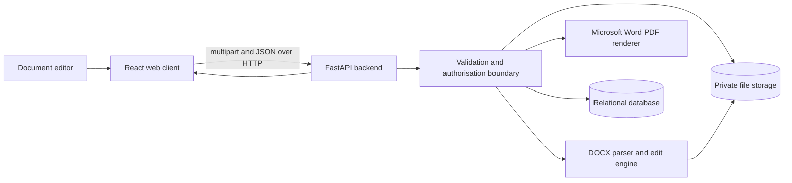
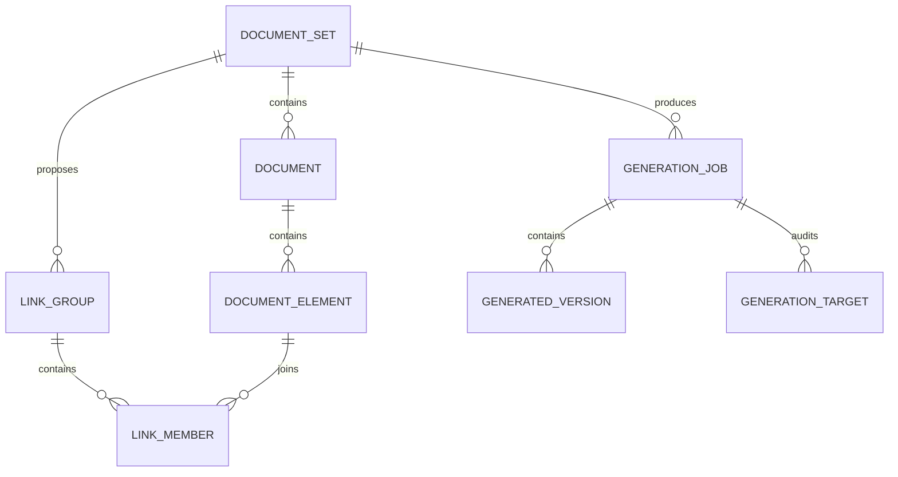

# Phase 2 architecture

## Trust boundary

The browser never receives database credentials or storage credentials. All document access, matching, preview, generation, and download decisions pass through the backend.

## Local-development storage

- Original files: `apps/api/data/originals/{document-set-id}/`
- Generated files: `apps/api/data/generated/{document-set-id}/{generation-id}/`
- Cached Word-layout PDFs: `apps/api/data/renders/{document-set-id}/`
- Local database: `apps/api/data/documentsync.db`

The paths are excluded from Git. Production deployment should replace local storage with private object storage and use short-lived or backend-mediated downloads.

## Relational model

## Controlled edit rule

A generated edit may only target `DocumentElement` rows that belong to the selected `LinkGroup`. The browser sends the explicitly included element IDs and the backend validates membership and requires the selected source element to remain included. Similarity or exact matching alone does not perform an edit; the user confirms the target list and reviews the impact before generation.

## Viewer and working-version boundary

The visual tab is a PDF exported by the installed Microsoft Word engine, so it uses Word's fonts, pagination, tables, images, headers, and footers. The separate Select text tab derives deterministic logical pages from extracted body elements and provides stable, keyboard-accessible element selection. Direct selection over the PDF awaits an element-to-render coordinate map.

Each `DocumentRecord` is a stable logical document. Its uploaded DOCX remains immutable. A confirmed edit creates a `GeneratedVersion`; the newest completed version becomes that document's current source for rendering, further edits, and downloads. The element rows and exact-match groups are refreshed transactionally after each applied edit, while `GenerationTarget` rows preserve the before/after audit trail.
