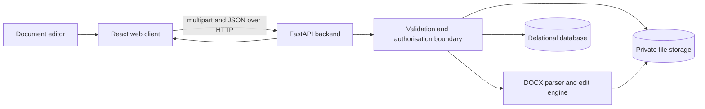
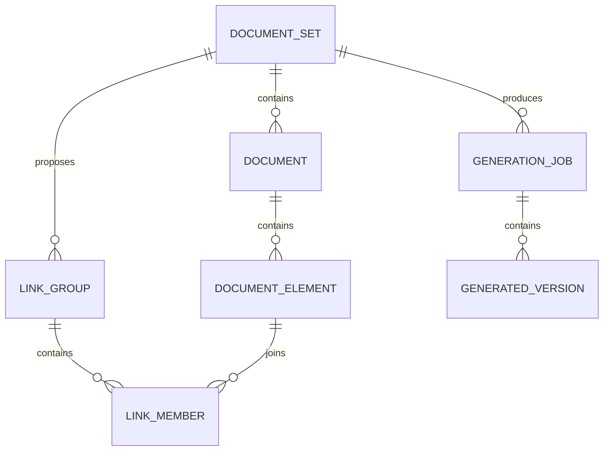

# Initial architecture

## Trust boundary

The browser never receives database credentials or storage credentials. All document access, matching, preview, generation, and download decisions pass through the backend.

## Local-development storage

- Original files: `apps/api/data/originals/{document-set-id}/`
- Generated files: `apps/api/data/generated/{document-set-id}/{generation-id}/`
- Local database: `apps/api/data/documentsync.db`

The paths are excluded from Git. Production deployment should replace local storage with private object storage and use short-lived or backend-mediated downloads.

## Relational model

## Controlled edit rule

A generated edit may only target `DocumentElement` rows that belong to the selected `LinkGroup`. Similarity or exact matching alone does not perform an edit; the user selects the group and confirms generation after previewing the locations.
